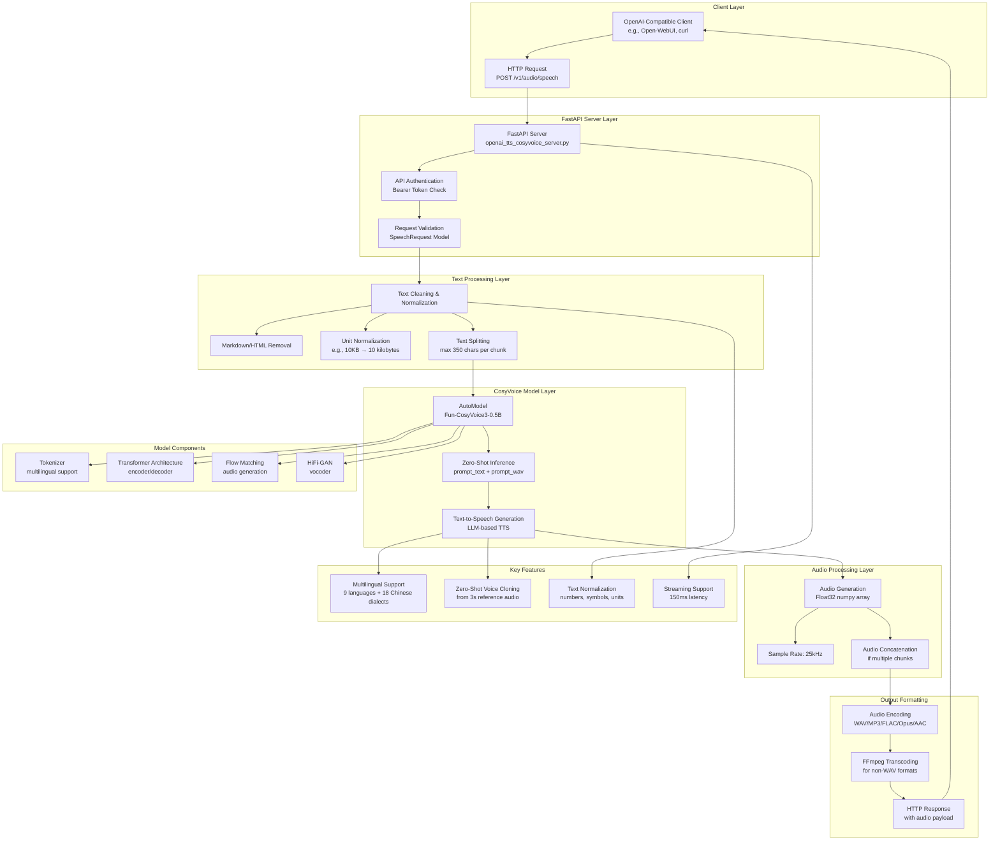

# CosyVoice FastAPI Project Workflow

## Component Details

### 1. **Client Layer**
- **OpenAI-Compatible API**: Uses same endpoints as OpenAI TTS API
- **Authentication**: Bearer token (configurable, default "not-needed")
- **Request Format**: JSON with text input, voice selection, speed control

### 2. **FastAPI Server Layer**
- **Server**: `openai_tts_cosyvoice_server.py`
- **Endpoints**: `/v1/audio/speech`, `/v1/models`
- **Validation**: Pydantic models for request validation

### 3. **Text Processing Layer**
- **Cleaning**: Removes markdown, HTML, control characters
- **Normalization**: Unicode normalization, punctuation standardization
- **Unit Conversion**: Converts technical units to spoken form (e.g., "10KB" → "10 kilobytes")
- **Splitting**: Breaks long text into 350-character chunks

### 4. **CosyVoice Model Layer**
- **Model**: Fun-CosyVoice3-0.5B (0.5 billion parameter LLM-based TTS)
- **Architecture**:
  - **Tokenizer**: Multilingual tokenizer with special control tokens
  - **Transformer**: Encoder-decoder architecture
  - **Flow Matching**: Continuous normalizing flow for audio generation
  - **HiFi-GAN**: Neural vocoder for high-quality audio synthesis
- **Inference Modes**:
  - Zero-shot: Voice cloning from reference audio
  - Cross-lingual: Language switching
  - Instruct: Fine-grained control (speed, emotion, dialect)

### 5. **Audio Processing Layer**
- **Generation**: Produces float32 audio arrays at 25kHz sample rate
- **Concatenation**: Combines multiple audio chunks if text was split
- **Format Conversion**: Supports WAV, MP3, FLAC, Opus, AAC formats

### 6. **Deployment Options**
- **Local**: FastAPI server with GPU acceleration
- **Docker**: Containerized deployment
- **TensorRT-LLM**: NVIDIA acceleration for 4x speedup
- **vLLM**: High-throughput inference engine

## Workflow Sequence

1. **Client Request** → OpenAI-compatible API call
2. **Authentication** → Bearer token validation
3. **Text Processing** → Cleaning, normalization, splitting
4. **Model Inference** → CosyVoice LLM generates audio tokens
5. **Audio Synthesis** → Flow matching + HiFi-GAN produce waveform
6. **Format Encoding** → Convert to requested audio format
7. **Response** → Return audio payload to client

## Key Technologies
- **PyTorch**: Deep learning framework
- **FastAPI**: Web server framework
- **SoundFile**: Audio I/O
- **FFmpeg**: Audio transcoding
- **Modelscope/HuggingFace**: Model distribution
- **CUDA**: GPU acceleration